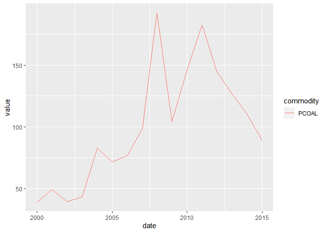

<!-- README.md is generated from README.Rmd. Please edit that file -->

# imfr

<!-- badges: start -->
<!-- badges: end -->

Originally created by Christopher Gandrud, imfr is an R package for
downloading data from the International Monetary Fund API endpoint.
Version 2, by Christopher C. Smith, is an extensive revision of the
package to make it both more powerful and more user-friendly. Version 2
is backward-compatible with Version 1, but most of the functions from
Version 1 are deprecated and will raise warnings if you try to use them.

## Why Version 2?

The previous version of `imfr` allowed for specifying only three
parameters—the same three for every database. This approach was
sufficient to query some databases, but not others. As a result, the
functionality of the package was limited, and many API requests failed.

The previous version also served users a third-party list of ISO2
country codes for use in requests rather than a database’s own internal
list of valid input codes. This, too, resulted in the failure of many an
API request.

In addition to correcting these major problems, Version 2 also extends
the functionality of the package to allow for both broader requests and
more specific requests than were possible in Version 1. Users may now
use a much larger set of filter parameters in making requests.
Additionally, Version 2 tries to address the problem of
user-friendliness by introducing more package documentation with
suggested workflows and example vignettes.

## Installation

To install the development version of `imfr`, use:

``` r
devtools::install_github("christophergandrud/imfr", build_vignettes = TRUE)'
```

## Usage

### Suggested packages

We recommend using `imfr` in combination with the `tidyverse`,
`stringr`, and `knitr` libraries, which introduce a powerful set of
functions for viewing and manipulating the data types returned by `imfr`
functions. Each of these packages can be installed from the CRAN
repository using the `install.packages` function. Once they are
installed, load these packages using the `library` function:

``` r
# Load libraries
library(imfr)
library(tidyverse)
library(stringr)
library(knitr)
```

### Fetching an Index of Databases with the imf_databases Function

The `imfr` package introduces four core functions: `imf_databases`,
`imf_parameters`, `imf_parameter_defs`, and `imf_dataset`. The function
for downloading datasets is `imf_dataset`, but you will need the other
functions to determine what arguments to supply to `imf_dataset`. For
instance, all calls to `imf_dataset` require a `database_id`. This is
because the IMF serves many different databases through its API, and the
API needs to know which of these many databases you’re requesting data
from. To obtain a list of databases, use `imf_databases`, like so:

``` r
#Fetch the list of databases available through the IMF API
databases <- imf_databases()
```

This function returns the IMF’s listing of 259 databases available
through the API. (In reality, 7 of the listed databases are defunct and
not actually available: FAS_2015, GFS01, FM202010, APDREO202010,
AFRREO202010, WHDREO202010, BOPAGG_2020.)

To view and explore the database list, it’s possible to open a viewing
pane with `View(databases)` or to create an attractive table with
`kintr::kable(databases)`. Or, if you already know which database you
want, you can fetch the corresponding code by searching the description
column for the database name with `stringr::str_detect`. For instance,
here’s how to search for the Primary Commodity Price System:

``` r
# Filter the 'databases' data frame for descriptions matching `commodity price`
commodity_db <- databases[str_detect(tolower(databases$description),"commodity price"),]

# Display the result using knitr::kable
kable(commodity_db)
```

|     | database_id | description                           |
|:----|:------------|:--------------------------------------|
| 245 | PCPS        | Primary Commodity Price System (PCPS) |

### Fetching a List of Parameters and Input Codes with imf_parameters and imf_parameter_defs

Once you have a database_id, it’s possible to make a call to
`imf_dataset` to fetch the entire database:
`imf_dataset(commodity_db$database_id)`. However, while this will
succeed for some small databases, it will fail for many of the larger
ones. And even when it succeeds, fetching an entire database can take a
long time. You’re much better off supplying additional filter parameters
to reduce the size of your request.

Requests to databases available through the IMF API are complicated by
the fact that each database uses a different set of parameters when
making a request. There are, in fact, 2 unique parameters used in
different database requests! You also have to have the list of valid
input codes for each parameter. The `imf_parameters` function solves
this problem. Use the function to obtain the full list of parameters and
valid input codes for a given database:

``` r
# Fetch list of valid parameters and input codes for commodity price database
params <- imf_parameters(commodity_db$database_id)
```

The `imf_parameters` function returns a named list of data frames. Each
named list item corresponds to a parameter used in making requests from
the database.

``` r
# Check class of `params` object
class(params)
#> [1] "list"

# Check names of `params` list items
names(params)
#> [1] "freq"         "ref_area"     "commodity"    "unit_measure"
```

In the event that a parameter name is not self-explanatory, the
`imf_parameter_defs` function can be used to fetch short text
descriptions of each parameter:

``` r
# Fetch and display parameter text descriptions for the commodity price database
param_descriptions <- imf_parameter_defs(commodity_db$database_id)
kable(param_descriptions)
```

| parameter    | description        |
|:-------------|:-------------------|
| freq         | Frequency          |
| ref_area     | Geographical Areas |
| commodity    | Indicator          |
| unit_measure | Unit               |

Each named list item is a data frame containing a vector of valid input
codes that can be used with the named parameter, and a vector of text
descriptions of what each code represents. The `$` operator can be used
to access the data frame for a given parameter, and the data frame can
be explored using `kable` or `View`:

``` r
# Display the data frame of valid input codes for the frequency parameter
kable(params$freq)
```

| input_code | description |
|:-----------|:------------|
| A          | Annual      |
| M          | Monthly     |
| Q          | Quarterly   |

### Supplying Parameter Arguments to imf_dataset: A Tale of Two Workflows

There are two ways to supply parameters to `imf_dataset`: by supplying
vector arguments or by supplying a modified parameters list. The vector
arguments workflow will likely be more intuitive for most users, but the
list argument workflow is more robust against changes to the API
endpoint. If you ever get an “unused argument” error when trying to use
the vector arguments workflow, try using the list argument workflow
instead.

To supply vector arguments, just find the codes you want and supply them
to `imf_dataset` using the parameter name as the argument name. The
example below shows how to request 2000–2015 annual coal prices from the
Primary Commodity Price System database:

``` r
# Fetch the 'freq' input code for annual frequency
selected_freq <- params$freq$input_code[str_detect(tolower(params$freq$description),"annual")]

# Fetch the 'commodity' input code for coal
selected_commodity <- params$commodity$input_code[str_detect(tolower(params$commodity$description),"coal index")]

# Fetch the 'unit_measure' input code for index
selected_unit_measure <- params$unit_measure$input_code[str_detect(tolower(params$unit_measure$description),"index")]

# Request data from the API
df <- imf_dataset(database_id = commodity_db$database_id,
         freq = selected_freq, commodity = selected_commodity,
         unit_measure = selected_unit_measure,
         start_year = 2000, end_year = 2015)
#> Error in curl::curl_fetch_memory(url, handle = handle): Failure when receiving data from the peer
#> Request failed [ERROR]. Retrying in 4.1 seconds...

# Display the first few entries in the retrieved data frame using knitr::kable
kable(head(df))
```

| date | value            | freq | ref_area | commodity | unit_measure | unit_mult | time_format |
|:-----|:-----------------|:-----|:---------|:----------|:-------------|:----------|:------------|
| 2000 | 39.3510230293202 | A    | W00      | PCOAL     | IX           | 0         | P1Y         |
| 2001 | 49.3378587284039 | A    | W00      | PCOAL     | IX           | 0         | P1Y         |
| 2002 | 39.4949091648006 | A    | W00      | PCOAL     | IX           | 0         | P1Y         |
| 2003 | 43.2878876950788 | A    | W00      | PCOAL     | IX           | 0         | P1Y         |
| 2004 | 82.9185858052862 | A    | W00      | PCOAL     | IX           | 0         | P1Y         |
| 2005 | 71.9223526096731 | A    | W00      | PCOAL     | IX           | 0         | P1Y         |

To supply a list object, modify each data frame in the `params` list
object to retain only the rows you want, and then supply the modified
list object to `imf_dataset` as its `parameters` argument. Here is how
to make the same request for annual coal price data using a parameters
list:

``` r
# Filter the frequency data frame for annual frequency
params$freq <- params$freq %>%
    filter(str_detect(tolower(.$description),"annual"))

# Filter the commodity data frame for the coal index
params$commodity <- params$commodity %>%
    filter(str_detect(tolower(.$description),"coal index"))

# Filter the unit_measure data frame for index
params$unit_measure <- params$unit_measure %>%
    filter(str_detect(tolower(.$description),"index"))

# Request data from the API
df <- imf_dataset(database_id = commodity_db$database_id,
               parameters = params,
         start_year = 2000, end_year = 2015)

# Display the first few entries in the retrieved data frame using knitr::kable
kable(head(df))
```

| date | value            | freq | ref_area | commodity | unit_measure | unit_mult | time_format |
|:-----|:-----------------|:-----|:---------|:----------|:-------------|:----------|:------------|
| 2000 | 39.3510230293202 | A    | W00      | PCOAL     | IX           | 0         | P1Y         |
| 2001 | 49.3378587284039 | A    | W00      | PCOAL     | IX           | 0         | P1Y         |
| 2002 | 39.4949091648006 | A    | W00      | PCOAL     | IX           | 0         | P1Y         |
| 2003 | 43.2878876950788 | A    | W00      | PCOAL     | IX           | 0         | P1Y         |
| 2004 | 82.9185858052862 | A    | W00      | PCOAL     | IX           | 0         | P1Y         |
| 2005 | 71.9223526096731 | A    | W00      | PCOAL     | IX           | 0         | P1Y         |

### Working with the Returned Data Frame

Note that all columns in the returned data frame are character vectors,
and that to plot the series we will need to convert to valid numeric or
date formats:

``` r
#Coerce date and value columns to plottable formats and create a simple plot
df %>%
    mutate(date = as.Date(paste0(date,"-01-01")),
           value = as.numeric(value)) %>%
    ggplot(aes(x=date,y=value,color=commodity)) +
    geom_line()
```



Also note that the returned data frame has mysterious-looking codes as
values in some columns.

Codes in the `time_format` column are [ISO 8601 duration
codes](https://en.m.wikipedia.org/wiki/ISO_8601#Durations). In this
case, “P1Y” means “periods of 1 year.” The `unit_mult` column represents
the number of zeroes you should add to the `value` column. For instance,
if `value` is in millions, then the unit multiplier will be 6. If in
billions, then the unit multiplier will be 9.

The meanings of the other codes are stored in our `params` object and
can be fetched with a join. For instance to fetch the meaning of the
ref_area code “W00”, we can perform a left join with the
`params$ref_area` data frame and use `select` to replace ref_area with
the parameter description:

``` r
# Join df with params$ref_area to fetch code description
df <- left_join(df,params$ref_area,by=c("ref_area"="input_code")) %>%
    select(date, value, freq, ref_area = description, commodity, unit_measure, unit_mult, time_format)

# Display the first few entries in the retrieved data frame using knitr::kable
kable(head(df))
```

| date | value            | freq | ref_area                        | commodity | unit_measure | unit_mult | time_format |
|:-----|:-----------------|:-----|:--------------------------------|:----------|:-------------|:----------|:------------|
| 2000 | 39.3510230293202 | A    | All Countries, excluding the IO | PCOAL     | IX           | 0         | P1Y         |
| 2001 | 49.3378587284039 | A    | All Countries, excluding the IO | PCOAL     | IX           | 0         | P1Y         |
| 2002 | 39.4949091648006 | A    | All Countries, excluding the IO | PCOAL     | IX           | 0         | P1Y         |
| 2003 | 43.2878876950788 | A    | All Countries, excluding the IO | PCOAL     | IX           | 0         | P1Y         |
| 2004 | 82.9185858052862 | A    | All Countries, excluding the IO | PCOAL     | IX           | 0         | P1Y         |
| 2005 | 71.9223526096731 | A    | All Countries, excluding the IO | PCOAL     | IX           | 0         | P1Y         |

Alternatively, we can simply replace the code in our data series with
the corresponding description in `params`. Here, we replace each
`unit_measure` code with the corresponding description in
`params$unit_measure`:

``` r
# Replace each unique unit_measure code in df with corresponding description
# in params$unit_measure
for(code in unique(df$unit_measure)){
    df$unit_measure[df$unit_measure == code] <- params$unit_measure$description[params$unit_measure$input_code == code]
}

# Display the first few entries in the retrieved data frame using knitr::kable
kable(head(df))
```

| date | value            | freq | ref_area                        | commodity | unit_measure | unit_mult | time_format |
|:-----|:-----------------|:-----|:--------------------------------|:----------|:-------------|:----------|:------------|
| 2000 | 39.3510230293202 | A    | All Countries, excluding the IO | PCOAL     | Index        | 0         | P1Y         |
| 2001 | 49.3378587284039 | A    | All Countries, excluding the IO | PCOAL     | Index        | 0         | P1Y         |
| 2002 | 39.4949091648006 | A    | All Countries, excluding the IO | PCOAL     | Index        | 0         | P1Y         |
| 2003 | 43.2878876950788 | A    | All Countries, excluding the IO | PCOAL     | Index        | 0         | P1Y         |
| 2004 | 82.9185858052862 | A    | All Countries, excluding the IO | PCOAL     | Index        | 0         | P1Y         |
| 2005 | 71.9223526096731 | A    | All Countries, excluding the IO | PCOAL     | Index        | 0         | P1Y         |

### View the imfr Vignettes Demonstrating the Two Workflows

See also the vignettes, which can be accessed with
`vignette("ParametersList")` and `vignette("ParametersVectors")`.

## Development Notes

Planned features for future versions:

- Add a workaround to support “All” codes that are listed as valid input
  codes in the IMF parameters lists but don’t actually work when used in
  API requests
- Determine maximum length of a request URL, and split into multiple
  requests if the URL is too long
- Submit to CRAN
